# Sanpyl-Indoor-Camera
A brief analysis of the Sanpyl-Indoor-Camera, a self-delcared 'IoT smart security camera' that offers a mobile app with integrated video feed and movement for said device.This report will explore both the hardware and software aspects of this device to include the methods and approaches taken in addition to those vulnerabilities that were exploited. 

Product Link: https://www.amazon.com/dp/B0CJFRC9HT

APK Link: https://apkcombo.com/icam365/com.tange365.icam365/

## Table of Contents
- [Sanpyl-Indoor-Camera](#sanpyl-indoor-camera)
  - [Table of Contents](#table-of-contents)
  - [Introduction](#introduction)
  - [Research Goals](#research-goals)
  - [Research Method](#research-method)
    - [Method: Hardware](#method-hardware)
    - [Method: Software](#method-software)
    - [Method: Networking](#method-networking)
  - [Implementation](#implementation)
    - [Implementation: Hardware](#implementation-hardware)
  - [Implementation: Software](#implementation-software)
  - [Results](#results)

## Introduction
This device serves itslef as a affordable at-home security camera that comes fully suited with mobile application, camera along with adjustable head that is controllable via the app. The device is currently listed at $25, and allows the user to talk and listen to audio being recorded by the device. Due to its affordable price and offering of a mobile app (along with handling sensitive data like audio and video) I thought this to be the perfect device for my analysis. Cheaper IoT devices often are not developed with security in mind, making them a prime target for security researchers. 

## Research Goals
In pursuing this IoT device, there were a few questions and goals I had in mind to help guide this work:
- What hardware composed this device?
- Is the firmware easily extractable? 
  - If so, what vulnerabilities exist within the firmware?
- What vulnerabilities existed, if any, in the mobile application?
- What ports/services were open and accessible on the device?
- Is it possible for a malicous actor to intercept video/audio on the device?
- Is it possible for a malicious actor to send commands of their own to move the device?

## Research Method
In order to carry out research on this device, there needed to be a few approaches implemented for analysis on hardware, software, and networking levels.

### Method: Hardware
In pursuing answers regarding the hardware, I would at the very least aim to obtain two copies of the device; one of these would serve to take apart and analyze while the other would serve as an test subject for penetration testing/exploit analysis. In this approach, I do not risk losing the device that is currently configured with my phone and network for penetration testing when cracking it open to analyze the hardware and vice versa. 

Tools for anlaysis of the hardware for this device will include USB-to-TTL converters, and PuTTY/MobaXTerm for manual debuggig via a serial connection. 

### Method: Software
In order to analyze the software, I planned to download the mobile application to both my iPhone as well as obtain the APK for static analysis. With this combination, I cover both dynamic and static analysis, utiilizing the device in real time using my personal phone while using a variety of analysis tools for static analysis. Although differnt operating systems, I believe the underlying functionality for these devices to be incredibly similar if not the same. 

Tools for analysis of the software for this device will include MobSF for static analysis, in addition to jd-gui for manual static analysis of jar source files. 

### Method: Networking
In order to properly assess the network traffic of the device, I utilized my laptop and its 'hotspot' feature to intercept communications to and from the device. Because of the nature of most IoT devices, traffic sent to the device itself is often times UDP traffic that is largely un-encrypted. This will allow thorough analysis of the network traffic of the device, to include possible scripting leading us to control the device ourselves. 

Tools for analysis of the networking for this device will include python for scripting, and Wireshark for packet analysis. 

## Implementation
Depending on the area of focus for the device meant we were to take different approaches and thus have different implementations for our reversing.

### Implementation: Hardware
As previously mentioned, one version of the device we obtained was completely torn apart to allow for the best understanding of the device as possible. Images of the central PCB of the device are as follows:

For this device, we see we have a GOKE SoC behind the device's core functionality. We also see to the left of the SoC lies two possible soldering connections; these are for UART debug ports and are Tx and Rx (from top to bottom). Due to the placement of the debug ports (and my poor soldering skills) I was unable to fully tap into the ports and access the device's underlying firmware. What I could capture can be found in the PuTTY screenshot below:

From the screenshot above, we can confirm the device is running some form of Uboot as its boot-loader, and it looks as though we can get a shell, but without a stable connection to the debug interfaces we are unable to extract the firmware of the device. Here, we utilized PuTTY via a USB-to-TTL converter on baud rate 115200, which is the most common rate for IoT devices. 

## Implementation: Software
With an inability to do much more for the hardware, I spent most of my focus doing what I could in terms of the harware. Firstly, I made sure to setup the device and perform a simple NMAP scan of the device to see which ports were open:

From the above screenshot, we can see there are a few ports open we could attempt to access. We first see there is a http server running on the device, which is supposedly vulnerable to a DDOS attack per our vuln script. This isnt incredibly helpful, as our goal is moreso to control/gather information from the device more than just crashing services. However, we can attempt to use DirBuster to scan directories that may be interesting to us:

Sadly, dirbuster did not provde incredibly fruitful due to the device's inability to keep up with requests. Even slowing the number of threads/speed of the queries did not seem to result with interesting directories. 

One of the more interesting ports would includes port 554, which runs the rtsp protocol or 'Real Time Streaming Protocol'. If there were any port that would allow an attacker to access live camera and audio feed easily, it would be this one. Therefore, I utilized a tool, ffmpeg, with command line arguments in an attempt to capture said audio/visual traffic. Intererstingly enough, this device does not have any security on this port, which resulted in my ability to record video and audio with just a simple command line command:

In the above screenshot, we can see we have live video feed from the device! I also uploaded a sample video below via the following link (will redirect):

With video and audio captured, I next set my goals on controlling the device via some python scripting and wireshark for packet capture and analysis. I was able to successfully setup my laptop as a hotspot, and when setting up my device on my phone I simply connected the device to my laptop instead of my Wi-Fi so I could sniff all packets going to and from the device:

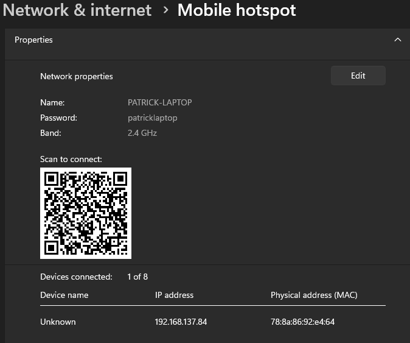

Using Wireshark, I was able to make a number of discoveries regarding the network traffic that goes to and from the device. Firstly, in looking over the startup sequence when I first start the app on my phone, it looks as though the device contacts several servers when initializing its connection:

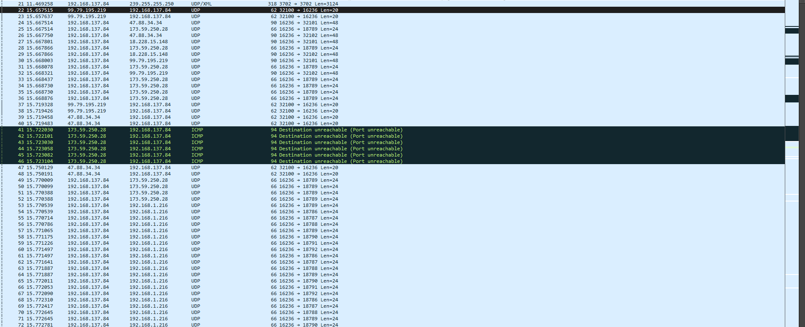

In the above screenshot, our device (192.168.137.84) reaches out to the following servers before contacting our phone (192.168.1.216):

- 47.88.34.34
- 173.59.250.28
- 18.228.15.148
- 99.79.195.219

However, for those with hunch for detail, will notice the server at 99.79.195.219 reaches out to the device itself. It sends multiple of the displayed 20 byte packets to the device to outline which devices to reach out to. If this is true, we should see a packet detailing the connection to our phone, which we do! To even include its port:

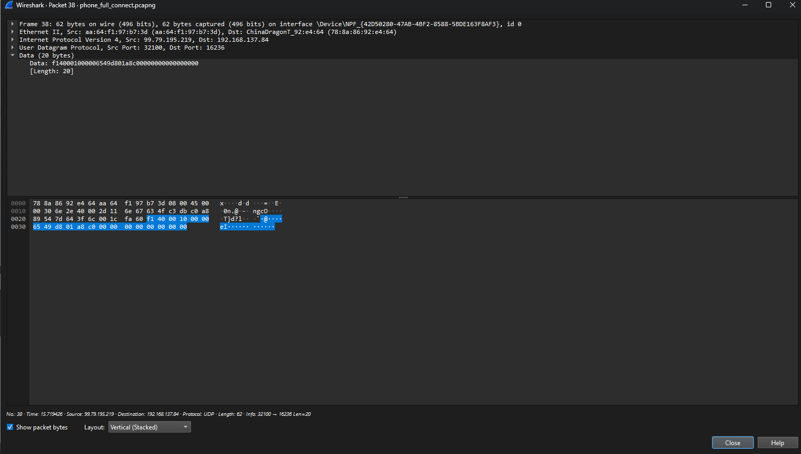

In the above screenshot, we see the bytes D801A8C0, which in little endian, would give us the address of 192.168.1.216. Looking at the bytes prior to this address, 6549, would give us 18789, the port in which we see the device reach out to in packet 53! This is incredibly helpful as we will be able to construct our own packet to tell the device to reach out to us later on. Without this information we would not be able to talk to the device. This is due to how the device manages its open port for communication - from analysis, it seems as though this device rotates its port every ~5 minutes, and confirms its open port roughly every 30 seconds with its servers. This would mean for our script to work, we would need to watch the traffic between our device and its servers to dynamically assign a port to reach out to, then have another thread running on the port we tell the device to connect to. We can see the cycles for port monitoring in the screenshots below: 

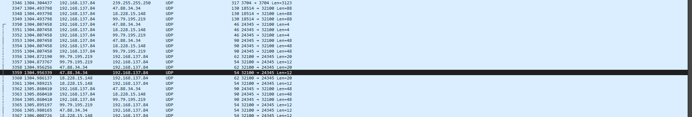

Above: we see the device in packets 3347-3349 announce to its servers its switching ports (from port 18514) to its new port on 24345. In the following screenshot we see the device again switch ports (300 seconds later) from port 24345 to 24288 (packets 3741-3743):

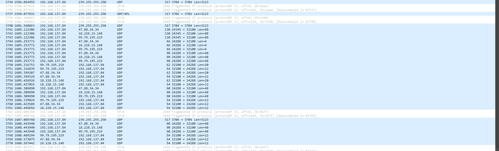

As a side note, those packets that are 4 bytes in size seem to be keep alive packets (important for later). The sequence of 48 byte packets sent from the device and 12 byte packets sent from the servers is the rough 30 second port alert as mentioned previously. 

After we get the device to reach out to us, it seems as though there are a few exchanges that happen prior to data being sent:

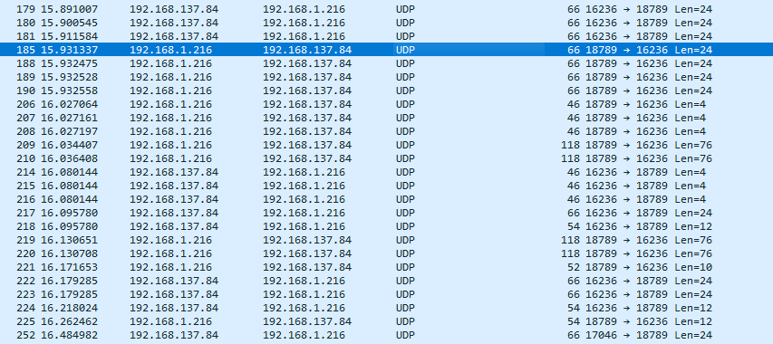

This, feels to me as though its some kind of rudimentry auth or confirmation exchange, with some keep alive packets sprinkled in. Those 76 byte packets are what I believe hold auth information as shown below:

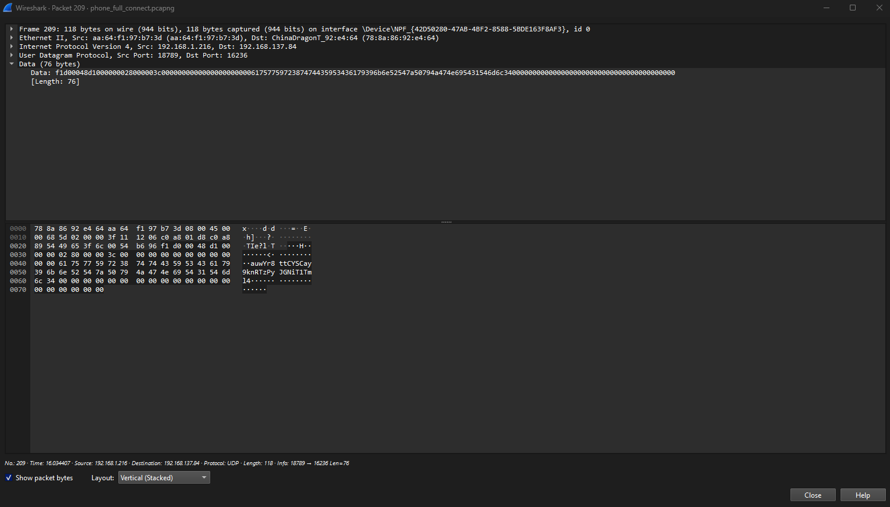

The following is a sample of a keep alive packet, although they alternate between F1E00000 and F1E10000:

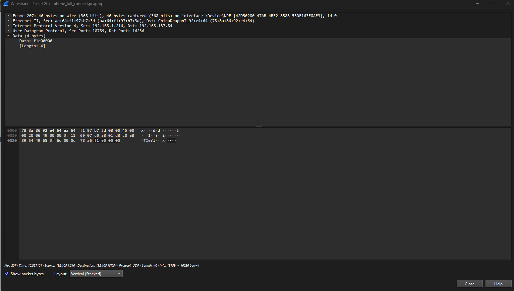

The remaining packets are hardcoded, and for the sake of not making this report too long, we wont get into too much detail regarding them. Following this exchange, we have a continuous back and forth of keep alive packets until the user interacts with the device from the app. Once the user opens the camera and physical control panel, another exchange occurs where some hardcoded device options are sent to the device and then the exchange of data takes place:

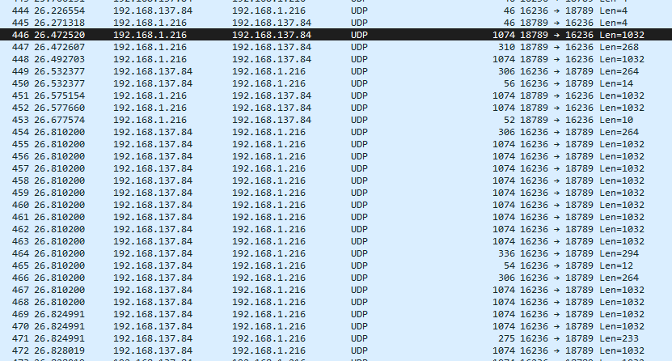

From what I could gather and put together, the following packets are commands that the user can send to the device. The following is a 'move up' command packet:

'Move down' packet:

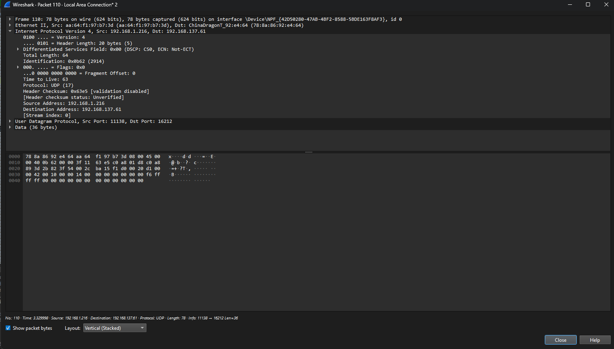

'Move right' packet:

And finally a 'move left' packet:

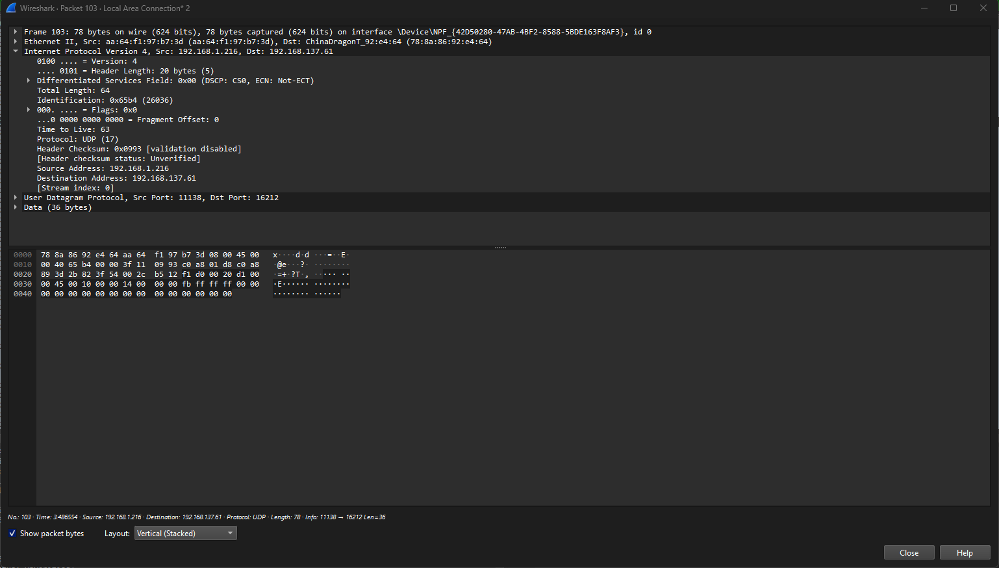

In order to obtain these packets, I really just sent a lot of continous commands to the device from the app and watched for re-occuring patterns within Wireshark. All packets share some similarities, including that all payloads are 36 bytes and start their payload with F1D0 which make them easy to detect. 

With a basic breakdown out of the way, we can now cover some of the code that is within our Scripts/movement.py file. Firstly, in designing this script, I aimed to have two threads running:

1. One to monitor keyboard input from the user, sending movement commands corresponding to the arrow keys
2. Another to listen on the port we tell the device to connect to (here port 8888)

Once the user hits ESC, the two threads will terminate and the program will exit. The device will continue sending traffic to our laptop until a certain number of keep alive packets are missed and the device goes back to circulating its open port with its servers. The following code is from the main function of the program where we take user input and start our threads:

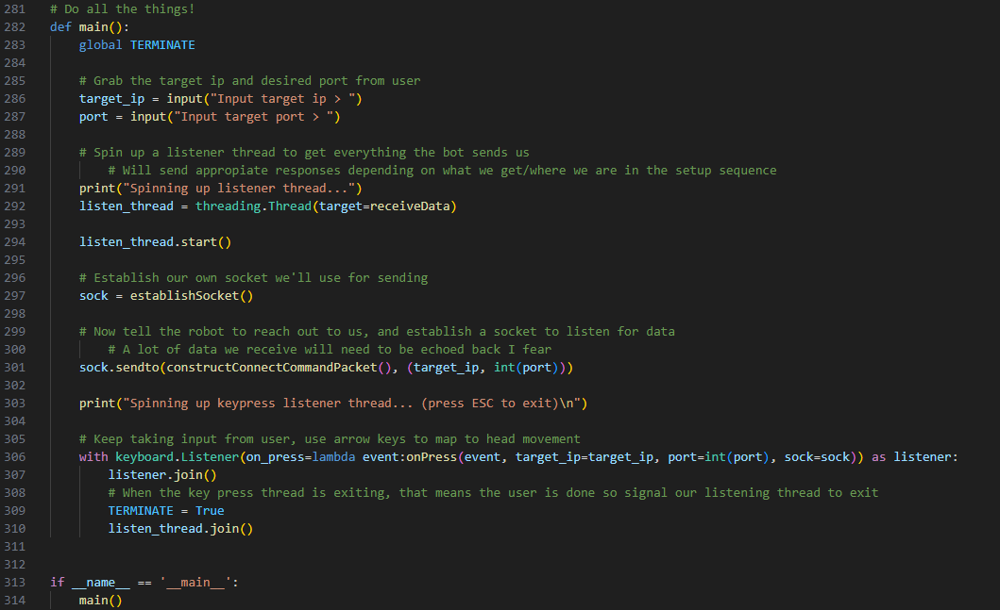

We can see here the callback for our threads, receiveData and onPress, which are detailed as follows:

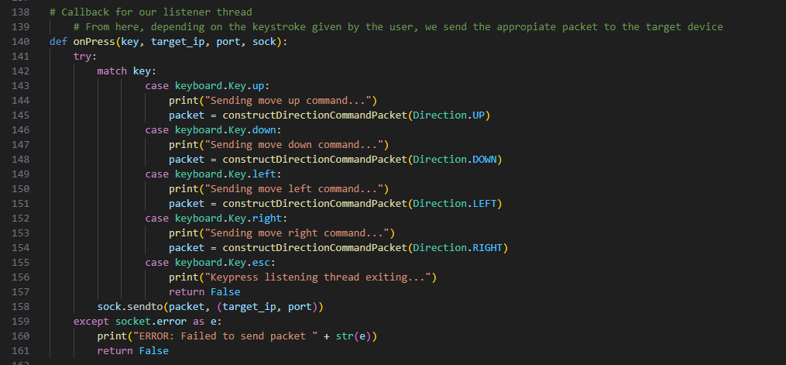

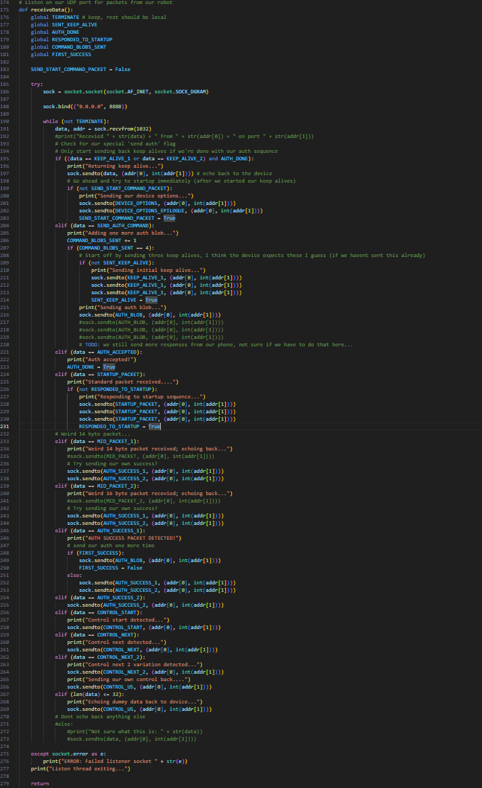

Depending on the keystroke, our onpress callback will construct an appropiate packet for sending to the device or exit the program:

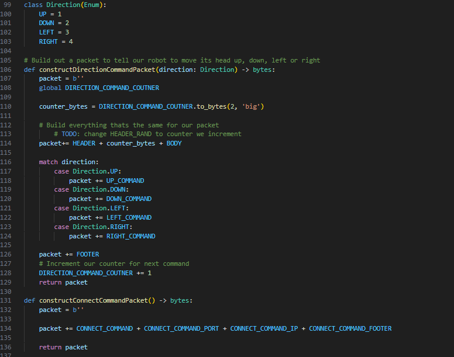

In our listener callback, we can see how we 'attempted' to construct repsonses to the server. A recorded demonstration of the current state of the script can be found at the following address:

- port scanning first 
- dir buster on port 80
- ffmpeg on rstp port
- wireshark on traffic
- go into pyhton code

## Results
