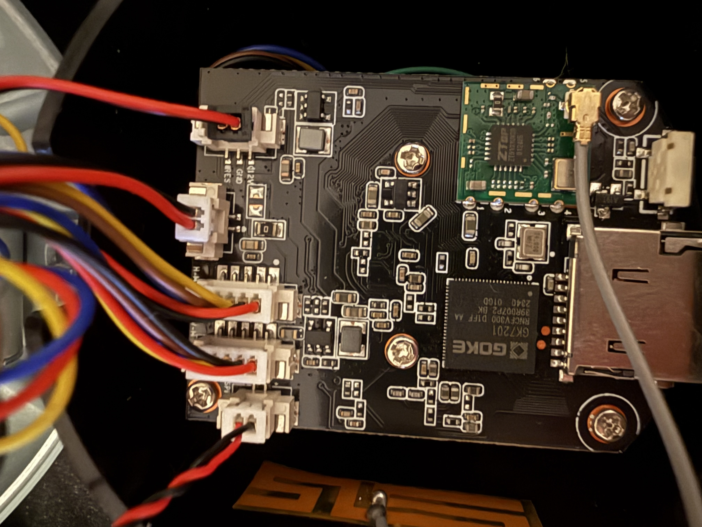
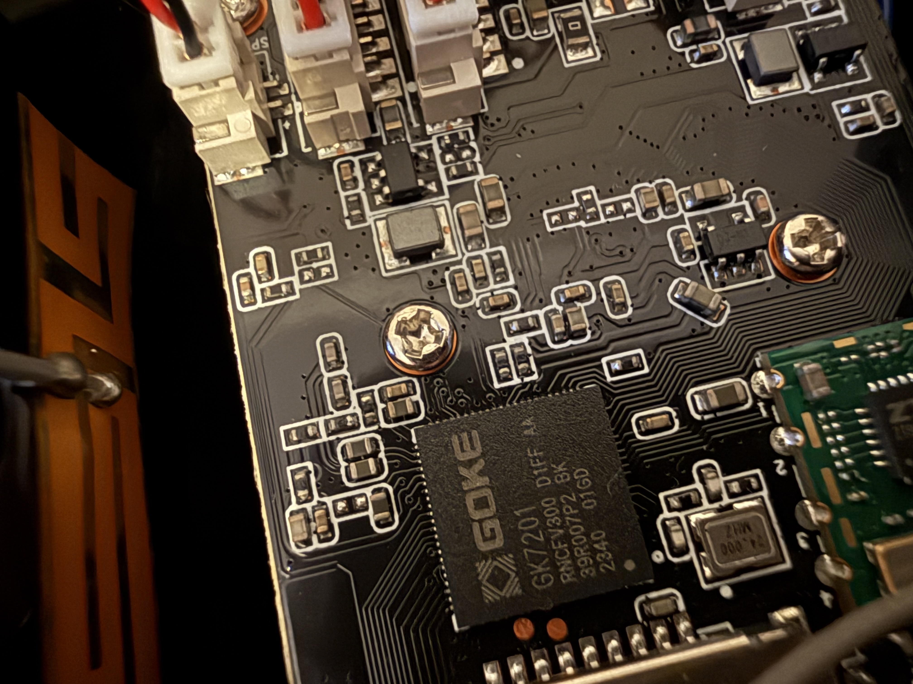
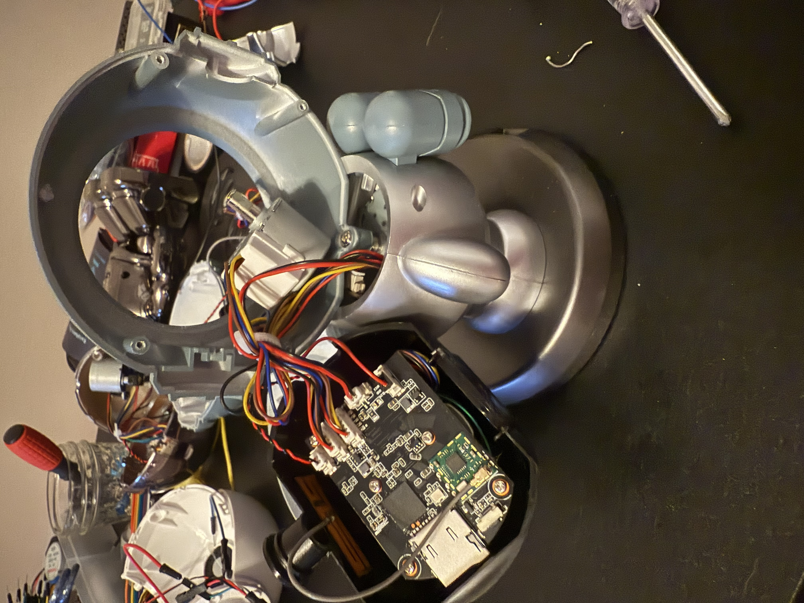
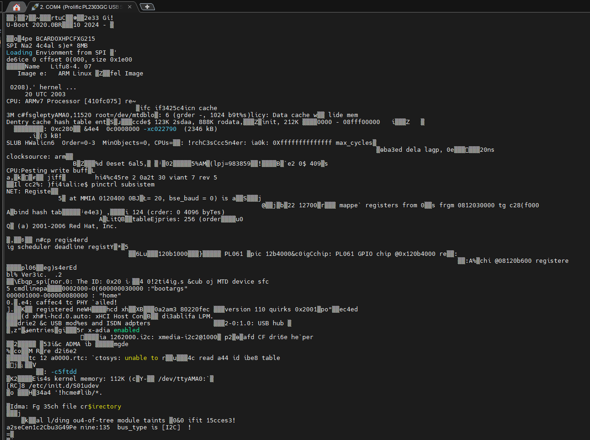
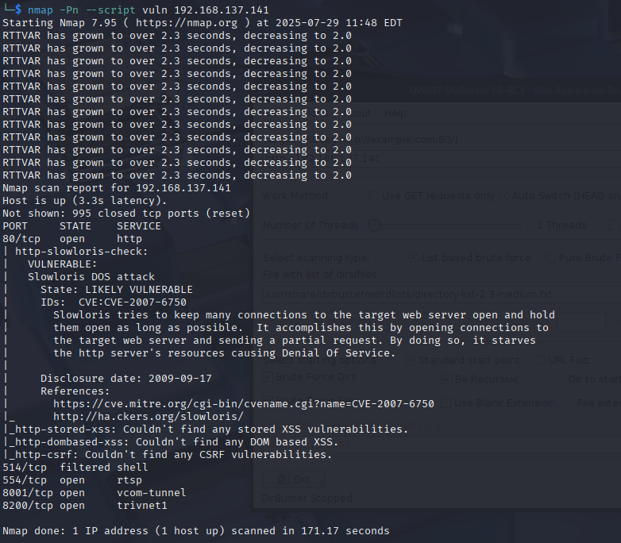
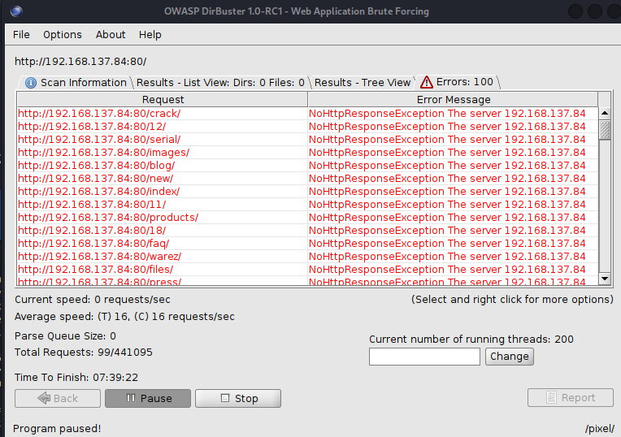
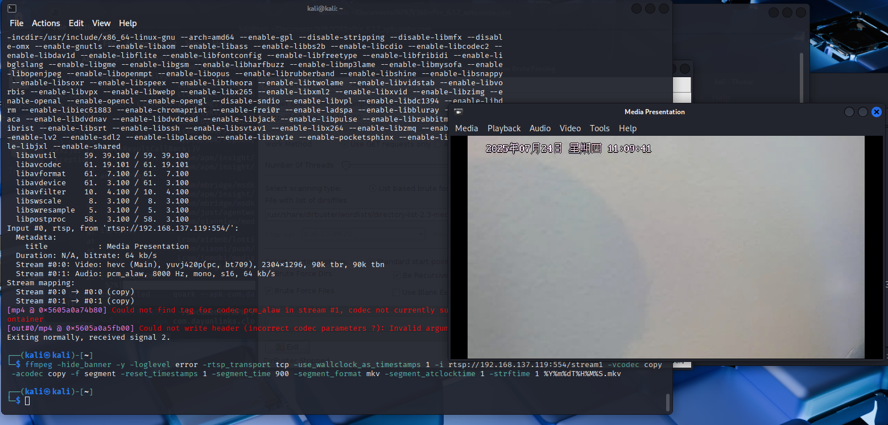

# Sanpyl-Indoor-Camera
A brief analysis of the Sanpyl-Indoor-Camera, a self-delcared 'IoT smart security camera' that offers a mobile app with integrated video feed and movement for said device.This report will explore both the hardware and software aspects of this device to include the methods and approaches taken in addition to those vulnerabilities that were exploited. 

Product Link: https://www.amazon.com/dp/B0CJFRC9HT

APK Link: https://apkcombo.com/icam365/com.tange365.icam365/

## Table of Contents
- [Sanpyl-Indoor-Camera](#sanpyl-indoor-camera)
  - [Table of Contents](#table-of-contents)
  - [Introduction](#introduction)
  - [Research Goals](#research-goals)
  - [Research Method](#research-method)
    - [Method: Hardware](#method-hardware)
    - [Method: Software](#method-software)
    - [Method: Networking](#method-networking)
  - [Implementation](#implementation)
    - [Implementation: Hardware](#implementation-hardware)
  - [Implementation: Software](#implementation-software)
  - [Results](#results)

## Introduction
This device serves itslef as a affordable at-home security camera that comes fully suited with mobile application, camera along with adjustable head that is controllable via the app. The device is currently listed at $25, and allows the user to talk and listen to audio being recorded by the device. Due to its affordable price and offering of a mobile app (along with handling sensitive data like audio and video) I thought this to be the perfect device for my analysis. Cheaper IoT devices often are not developed with security in mind, making them a prime target for security researchers. 

## Research Goals
In pursuing this IoT device, there were a few questions and goals I had in mind to help guide this work:
- What hardware composed this device?
- Is the firmware easily extractable? 
  - If so, what vulnerabilities exist within the firmware?
- What vulnerabilities existed, if any, in the mobile application?
- What ports/services were open and accessible on the device?
- Is it possible for a malicous actor to intercept video/audio on the device?
- Is it possible for a malicious actor to send commands of their own to move the device?

## Research Method
In order to carry out research on this device, there needed to be a few approaches implemented for analysis on hardware, software, and networking levels.

### Method: Hardware
In pursuing answers regarding the hardware, I would at the very least aim to obtain two copies of the device; one of these would serve to take apart and analyze while the other would serve as an test subject for penetration testing/exploit analysis. In this approach, I do not risk losing the device that is currently configured with my phone and network for penetration testing when cracking it open to analyze the hardware and vice versa. 

Tools for anlaysis of the hardware for this device will include USB-to-TTL converters, and PuTTY/MobaXTerm for manual debuggig via a serial connection. 

### Method: Software
In order to analyze the software, I planned to download the mobile application to both my iPhone as well as obtain the APK for static analysis. With this combination, I cover both dynamic and static analysis, utiilizing the device in real time using my personal phone while using a variety of analysis tools for static analysis. Although differnt operating systems, I believe the underlying functionality for these devices to be incredibly similar if not the same. 

Tools for analysis of the software for this device will include MobSF for static analysis, in addition to jd-gui for manual static analysis of jar source files. 

### Method: Networking
In order to properly assess the network traffic of the device, I utilized my laptop and its 'hotspot' feature to intercept communications to and from the device. Because of the nature of most IoT devices, traffic sent to the device itself is often times UDP traffic that is largely un-encrypted. This will allow thorough analysis of the network traffic of the device, to include possible scripting leading us to control the device ourselves. 

Tools for analysis of the networking for this device will include python for scripting, and Wireshark for packet analysis. 

## Implementation
Depending on the area of focus for the device meant we were to take different approaches and thus have different implementations for our reversing.

### Implementation: Hardware
As previously mentioned, one version of the device we obtained was completely torn apart to allow for the best understanding of the device as possible. Images of the central PCB of the device are as follows:

For this device, we see we have a GOKE SoC behind the device's core functionality. We also see to the left of the SoC lies two possible soldering connections; these are for UART debug ports and are Tx and Rx (from top to bottom). Due to the placement of the debug ports (and my poor soldering skills) I was unable to fully tap into the ports and access the device's underlying firmware. What I could capture can be found in the PuTTY screenshot below:

From the screenshot above, we can confirm the device is running some form of Uboot as its boot-loader, and it looks as though we can get a shell, but without a stable connection to the debug interfaces we are unable to extract the firmware of the device. Here, we utilized PuTTY via a USB-to-TTL converter on baud rate 115200, which is the most common rate for IoT devices. 

## Implementation: Software
With an inability to do much more for the hardware, I spent most of my focus doing what I could in terms of the harware. Firstly, I made sure to setup the device and perform a simple NMAP scan of the device to see which ports were open:

From the above screenshot, we can see there are a few ports open we could attempt to access. We first see there is a http server running on the device, which is supposedly vulnerable to a DDOS attack per our vuln script. This isnt incredibly helpful, as our goal is moreso to control/gather information from the device more than just crashing services. However, we can attempt to use DirBuster to scan directories that may be interesting to us:

Sadly, dirbuster did not provde incredibly fruitful due to the device's inability to keep up with requests. Even slowing the number of threads/speed of the queries did not seem to result with interesting directories. 

One of the more interesting ports would includes port 554, which runs the rtsp protocol or 'Real Time Streaming Protocol'. If there were any port that would allow an attacker to access live camera and audio feed easily, it would be this one. Therefore, I utilized a tool, ffmpeg, with command line arguments in an attempt to capture said audio/visual traffic. Intererstingly enough, this device does not have any security on this port, which resulted in my ability to record video and audio with just a simple command line command:

In the above screenshot, we can see we have live video feed from the device! I also uploaded a sample video below:

<video src="https://github.com/pjsacchet/Sanpyl-Indoor-Camera/blob/main/Video_Captures/Stream1_Capture_24JUL25.mkv" width="600"></video>

- port scanning first 
- dir buster on port 80
- ffmpeg on rstp port
- wireshark on traffic
- go into pyhton code

## Results
